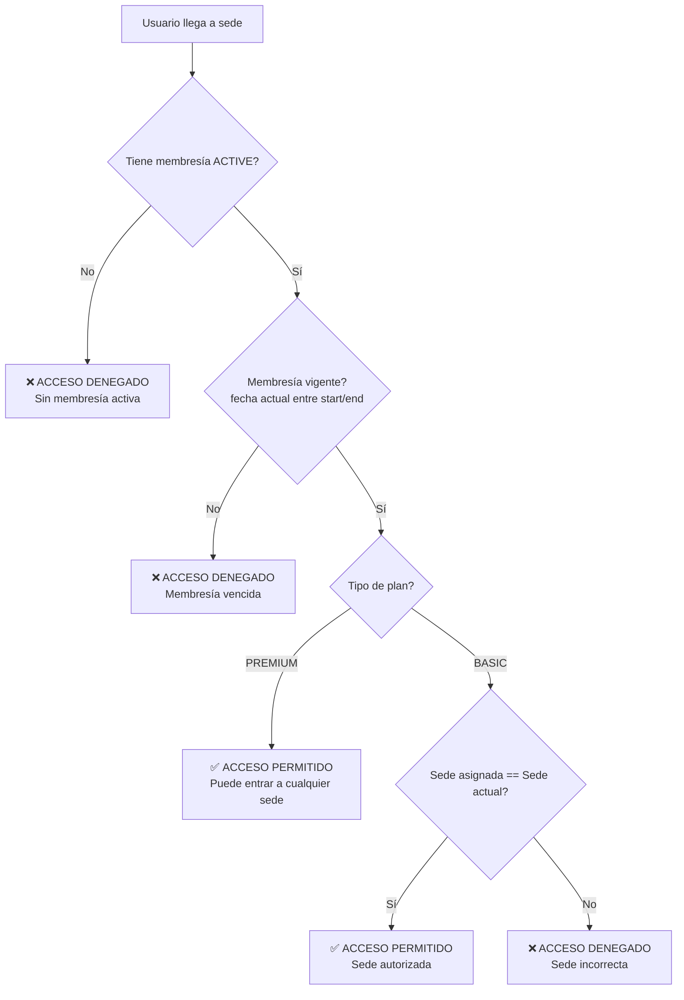
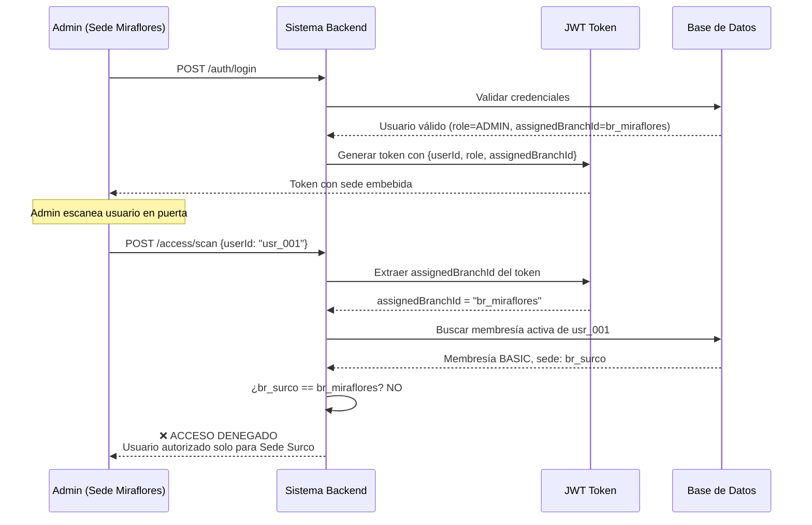
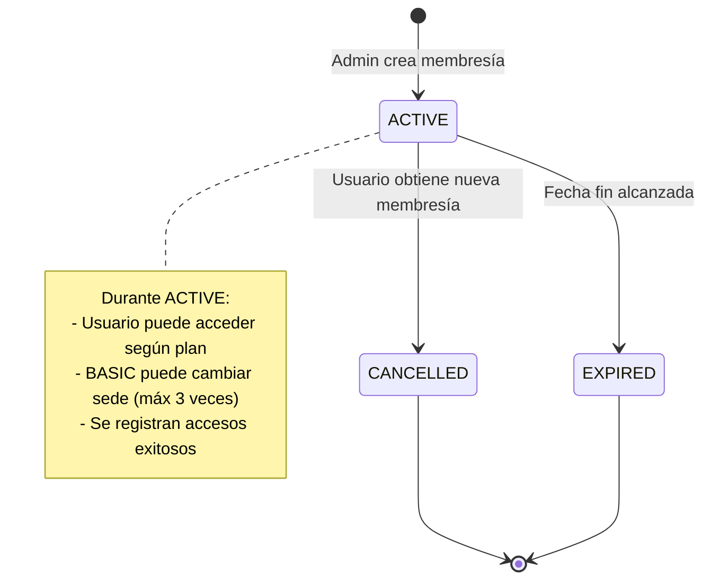

# FitPass - Sistema de Control de Acceso Multi-Sede para Gimnasios

## Contexto del Problema

La cadena de gimnasios más grande de Lima, **FitPass**, opera con 15 sedes distribuidas estratégicamente en distritos como Miraflores, San Isidro, Surco, La Molina, San Borja y Jesús María. Con más de 5,000 miembros activos, enfrentan un caos operacional diario: clientes con membresías básicas intentando ingresar a sedes no autorizadas, membresías vencidas que el personal no detecta a tiempo, falta de trazabilidad sobre quién ingresó a qué sede y cuándo, y disputas constantes cuando un cliente asegura que su plan le permite acceso total pero el sistema dice lo contrario.

El problema se agrava cada mañana a las 6 AM y cada tarde a las 6 PM, cuando cientos de personas llegan simultáneamente a diferentes sedes. Los guardias de seguridad deben validar manualmente carnets físicos, buscar nombres en listas de Excel desactualizadas, y tomar decisiones sobre acceso sin información confiable. Esto genera colas de 15-20 minutos en horas pico, clientes frustrados que cancelan sus membresías, y pérdidas económicas porque personas sin membresía activa logran colarse aprovechando el desorden.

**FitPass** nos ha contratado desde UTEC para desarrollar el sistema de control de acceso que transformará sus operaciones. La solución debe ser simple pero robusta: validación instantánea de acceso mediante escaneo de identificación de usuario, control granular basado en tipos de plan (básico vs premium), registro completo de cada entrada para auditoría, y herramientas administrativas para gestionar membresías de manera centralizada.

El modelo de negocio de FitPass se basa en dos tipos de planes claramente diferenciados. El **Plan BASIC** está diseñado para usuarios que entrenan consistentemente en una ubicación cercana a su casa o trabajo; al contratar este plan, el cliente elige una sede específica (su "sede de matrícula") y solo puede ingresar a esa ubicación. Este plan es más económico y representa el 70% de sus clientes. El **Plan PREMIUM** está orientado a profesionales que viajan constantemente entre distritos o prefieren flexibilidad total; este plan permite acceso ilimitado a todas las sedes de la red sin restricciones. Cuesta el doble que el plan básico pero representa el 30% de ingresos de la empresa.

La complejidad operacional radica en varios escenarios críticos que el sistema debe manejar correctamente. Cuando un usuario con plan BASIC llega a la Sede Miraflores pero su membresía está registrada para Sede Surco, el sistema debe **rechazar el acceso** con un mensaje claro indicando su sede autorizada. Si ese mismo usuario llega a Sede Surco con su membresía vencida (fecha de expiración pasada), también debe **rechazar el acceso** indicando que debe renovar. En contraste, un usuario PREMIUM puede llegar a cualquier sede en cualquier momento y el sistema debe **permitir el acceso**, siempre que su membresía esté vigente (dentro del rango de fechas).



Un aspecto diferenciador del negocio es la **flexibilidad limitada para cambio de sede en planes BASIC**. FitPass reconoce que las circunstancias de vida cambian: un cliente puede mudarse de Miraflores a La Molina, o su trabajo puede cambiar de ubicación. Para mantener la satisfacción del cliente sin perder el control del negocio, permite hasta **3 cambios de sede durante la vigencia de una membresía BASIC**. Por ejemplo, si un usuario contrata BASIC para Sede Miraflores en enero, en abril puede cambiar a Sede San Isidro (1er cambio), en julio a Sede Surco (2do cambio), y en octubre a Sede La Molina (3er cambio). Si intenta un cuarto cambio, el sistema debe rechazarlo indicando que agotó sus cambios permitidos y debe esperar a renovar su membresía anual.

El sistema opera con dos tipos de usuarios claramente diferenciados. Los **USUARIOS regulares** son los miembros del gimnasio: se registran en la plataforma creando su perfil con información personal, pero **no pueden auto-asignarse membresías ni modificar su propio acceso**. Su interacción principal es presentar su identificación en la puerta y consultar el estado de su membresía. Los **ADMINISTRADORES** son empleados de FitPass asignados a sedes específicas: cada admin trabaja físicamente en una sede particular (ej: Admin Juan trabaja en Sede Miraflores) y tiene permisos para crear membresías, asignarlas a usuarios, modificar sedes de membresías BASIC, y realizar el escaneo de entrada.

La asignación de sede del administrador es **operacional**: cada admin opera desde una tablet o computadora ubicada físicamente en la puerta de su sede. Cuando el admin hace login, su JWT contiene su sede asignada, y todos los escaneos que realice se registran como ocurridos en esa sede. Esto significa que un admin de Sede Miraflores que escanea a un usuario registra ese acceso en Miraflores, y el sistema valida si ese usuario específico tiene autorización para entrar a esa sede según su plan (BASIC debe coincidir con la sede, PREMIUM puede entrar a cualquiera).



**Desarrolla ownership total sobre esta solución**: este sistema es la primera línea de defensa del negocio contra pérdidas por accesos no autorizados y la columna vertebral de la experiencia del cliente. Si tu validación de acceso falla y permite entrar a alguien sin membresía activa, FitPass pierde dinero directamente. Si tu lógica de cambio de sede tiene errores y permite más de 3 cambios, destrozan su modelo de negocio. Si tus consultas son lentas y cada escaneo toma 5 segundos, se forman colas masivas que arruinan la experiencia. Si no registras correctamente las entradas, pierden capacidad de análisis sobre uso de sedes y patrones de clientes. En el mundo real, este código no solo procesa datos: protege ingresos, habilita expansión, y determina si los clientes renuevan o se van a la competencia. Esta mentalidad de pensar como dueño del producto es lo que te diferenciará en startups, consultoras y empresas tech.

---

## Especificaciones Técnicas

### Modelo de Datos y Diseño

Tu primer reto es **diseñar el modelo de datos** que capture correctamente este dominio de negocio. No te daremos las entidades; debes inferirlas del contexto. Piensa en:

- ¿Qué conceptos del mundo real necesitan representación? (sedes, usuarios, planes, membresías, registros de acceso, etc.)
- ¿Cómo diferenciarás entre usuarios regulares y administradores?
- ¿Dónde guardarás el tipo de plan (BASIC vs PREMIUM)?
- ¿Cómo modelarás la sede asignada a una membresía BASIC?
- ¿Cómo rastrearás los cambios de sede permitidos?
- ¿Qué información debe tener cada registro de acceso para auditoría?

**Reglas de Negocio Críticas que tu modelo debe soportar**:
- Un usuario solo puede tener **UNA membresía ACTIVE a la vez**
- Membresías BASIC requieren sede asignada, PREMIUM no
- Máximo **3 cambios de sede** durante la vigencia de una membresía BASIC
- Cada acceso exitoso debe quedar registrado con: usuario, sede, admin que escaneó, timestamp
- Administradores están asignados a una sede específica (operan físicamente ahí)



**Validaciones Críticas - SCAN de Acceso**:
1. Usuario existe en el sistema
2. Tiene membresía activa y vigente (status ACTIVE, fecha actual dentro del rango)
3. Extraer sede del admin del JWT
4. Validar según tipo de plan:
   - **PREMIUM**: Acceso permitido a cualquier sede
   - **BASIC**: Acceso permitido solo si sede de membresía coincide con sede del admin
5. Si permite acceso → Registrar entrada (AccessLog)
6. Si deniega → Retornar razón específica

**Validaciones Críticas - Cambio de Sede BASIC**:
1. Membresía existe y es BASIC (no PREMIUM)
2. Está ACTIVE (no vencida, no cancelada)
3. `branchChangesCount < 3` (aún tiene cambios disponibles)
4. Nueva sede existe y está activa
5. Nueva sede es diferente a la actual
6. Al cambiar: actualizar sede y incrementar contador

**Validaciones Críticas - Creación de Membresía**:
1. Si usuario tiene membresía ACTIVE previa → marcarla como CANCELLED
2. Si plan es BASIC → sede asignada es obligatoria
3. Si plan es PREMIUM → sede asignada debe ser null
4. Duración típica: 1 año desde fecha de creación

---

## Endpoints Requeridos

Implementa exactamente **6 endpoints**:

### 1. Registro de Usuario
**POST** `/auth/register` *(pública)*

Crea perfil de usuario regular (rol USER)

**Request Body:**
```json
{
  "username": "juan_perez",
  "email": "juan@email.com",
  "password": "Secure123",
  "fullName": "Juan Pérez López",
  "phone": "987654321"
}
```

**Response:** `201 Created`
```json
{
  "userId": "usr_001",
  "username": "juan_perez",
  "fullName": "Juan Pérez López",
  "email": "juan@email.com",
  "role": "USER",
  "createdAt": "2025-10-01T10:00:00Z"
}
```

---

### 2. Autenticación
**POST** `/auth/login` *(pública)*

**Request Body:**
```json
{
  "username": "juan_perez",
  "password": "Secure123"
}
```

**Response:** `200 OK`
```json
{
  "token": "eyJhbGciOiJIUzI1NiIsInR5cCI6IkpXVCJ9...",
  "userId": "usr_001",
  "role": "USER",
  "assignedBranchId": null,
  "expiresIn": 3600
}
```

**⚠️ IMPORTANTE**: El JWT debe incluir `userId`, `role`, `assignedBranchId` (si es ADMIN)

---

### 3. Crear/Asignar Membresía
**POST** `/memberships` *(protegida - solo ADMIN)*

**Request Body:**
```json
{
  "userId": "usr_001",
  "planType": "BASIC",
  "assignedBranchId": "br_miraflores",
  "durationMonths": 12,
  "price": 150.00
}
```

**Response:** `201 Created`
```json
{
  "membershipId": "mem_001",
  "userId": "usr_001",
  "userName": "Juan Pérez López",
  "planType": "BASIC",
  "assignedBranch": {
    "id": "br_miraflores",
    "name": "Sede Miraflores",
    "address": "Av. Larco 1234"
  },
  "startDate": "2025-10-01",
  "endDate": "2026-10-01",
  "price": 150.00,
  "status": "ACTIVE",
  "branchChangesRemaining": 3,
  "createdAt": "2025-10-01T11:00:00Z"
}
```

---

### 4. Escanear Usuario (Validar Acceso)
**POST** `/access/scan` *(protegida - solo ADMIN)*

**Request Body:**
```json
{
  "userId": "usr_001"
}
```

**Lógica**:
1. Extraer `assignedBranchId` del JWT del admin
2. Validar membresía activa y vigente
3. Validar según plan (PREMIUM: cualquier sede, BASIC: solo su sede)
4. Si permite → crear AccessLog
5. Retornar resultado

**Response - ACCESO PERMITIDO:** `200 OK`
```json
{
  "accessGranted": true,
  "message": "Acceso permitido",
  "user": {
    "userId": "usr_001",
    "fullName": "Juan Pérez López"
  },
  "membership": {
    "planType": "BASIC",
    "assignedBranch": "Sede Miraflores",
    "validUntil": "2026-10-01"
  },
  "branch": {
    "id": "br_miraflores",
    "name": "Sede Miraflores"
  },
  "timestamp": "2025-10-01T07:15:00Z"
}
```

**Response - ACCESO DENEGADO (Sede incorrecta):** `403 Forbidden`
```json
{
  "accessGranted": false,
  "reason": "WRONG_BRANCH",
  "message": "Tu plan BASIC solo permite acceso a Sede Surco. Sede actual: Sede Miraflores.",
  "user": {
    "userId": "usr_001",
    "fullName": "Juan Pérez López"
  },
  "membership": {
    "planType": "BASIC",
    "assignedBranch": "Sede Surco"
  },
  "attemptedBranch": "Sede Miraflores"
}
```

**Otros casos de denegación**:
- `MEMBERSHIP_EXPIRED`: Membresía vencida
- `NO_ACTIVE_MEMBERSHIP`: Sin membresía activa

---

### 5. Cambiar Sede de Membresía BASIC
**PATCH** `/memberships/{membershipId}/change-branch` *(protegida - solo ADMIN)*

**Request Body:**
```json
{
  "newBranchId": "br_surco"
}
```

**Response - Éxito:** `200 OK`
```json
{
  "membershipId": "mem_001",
  "userId": "usr_001",
  "planType": "BASIC",
  "previousBranch": {
    "id": "br_miraflores",
    "name": "Sede Miraflores"
  },
  "newBranch": {
    "id": "br_surco",
    "name": "Sede Surco"
  },
  "branchChangesUsed": 1,
  "branchChangesRemaining": 2,
  "updatedAt": "2025-10-01T12:00:00Z"
}
```

**Response - Límite alcanzado:** `409 Conflict`
```json
{
  "error": "BRANCH_CHANGES_LIMIT_REACHED",
  "message": "Has alcanzado el límite de 3 cambios de sede. Debes esperar hasta renovar tu membresía.",
  "branchChangesUsed": 3,
  "membershipValidUntil": "2026-10-01"
}
```

---

### 6. Consultar Membresía de Usuario
**GET** `/memberships/user/{userId}` *(protegida)*

**Control de acceso**:
- USER → solo su propia membresía
- ADMIN → cualquier membresía

**Response:** `200 OK`
```json
{
  "membership": {
    "membershipId": "mem_001",
    "planType": "BASIC",
    "assignedBranch": {
      "id": "br_miraflores",
      "name": "Sede Miraflores",
      "address": "Av. Larco 1234",
      "district": "Miraflores"
    },
    "startDate": "2025-10-01",
    "endDate": "2026-10-01",
    "daysRemaining": 365,
    "status": "ACTIVE",
    "price": 150.00,
    "branchChangesUsed": 0,
    "branchChangesRemaining": 3
  },
  "user": {
    "userId": "usr_001",
    "fullName": "Juan Pérez López",
    "email": "juan@email.com",
    "phone": "987654321"
  },
  "recentAccessHistory": [
    {
      "branch": "Sede Miraflores",
      "timestamp": "2025-10-01T07:15:00Z"
    },
    {
      "branch": "Sede Miraflores",
      "timestamp": "2025-09-30T18:30:00Z"
    }
  ]
}
```

---


**Recuerda**: El mayor puntaje proviene de **cómo planteas el problema y diseñas la solución**, no solo de que "funcione". Primero piensa, diseña y justifica; después implementa.

¡**Mucha suerte**! 💪🏋️‍♀️🚪
